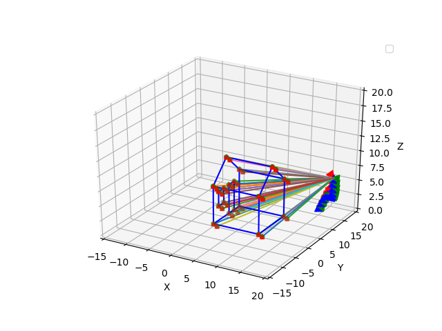
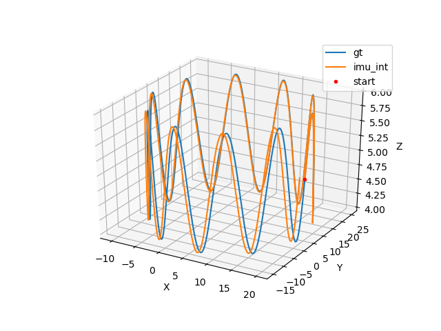
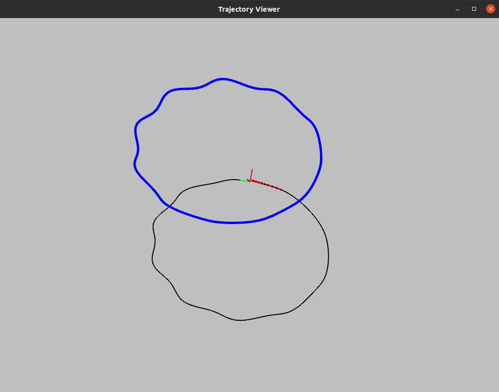
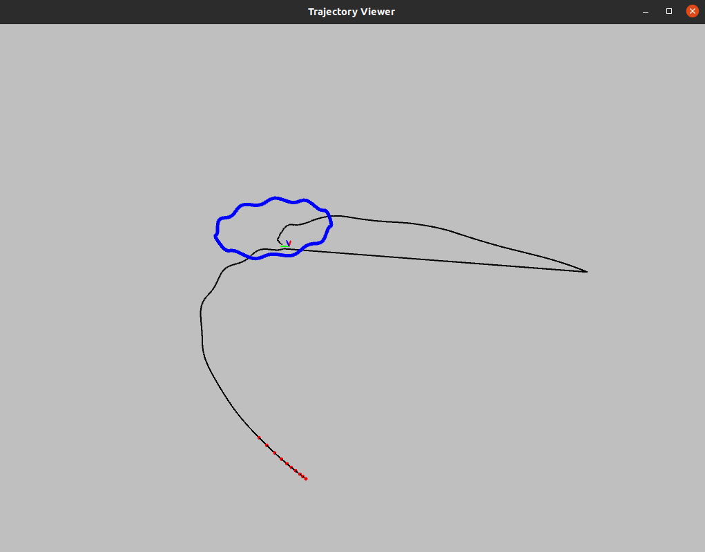

### 绘制轨迹

#### 1.1、 生成数据
相机参数为:
```cpp
double fx = 460;
double fy = 460;
double cx = 255;
double cy = 255;
double image_w = 640;
double image_h = 640;
```
IMU参数为：
```cpp
double gyro_bias_sigma = 1.0e-5;
double acc_bias_sigma = 0.0001;
double gyro_noise_sigma = 0.015;
double acc_noise_sigma = 0.019; 
```
相机到IMU的外参为:
```cpp
rot: [ 0, 0, -1,
        -1, 0, 0,
        0, 1, 0]
trans:[0.05,0.04,0.03]

```
仿真数据演示及轨迹：


相机的帧率设置为30fps,时间范围0-20，所以总共有600帧观测数据。这里的视觉跟踪没有使用lines,所以产生lines的部分可以注释。

#### 1.2、vins跟踪
发布IMU数据：
```cpp
void PubImuData()
{
	string sImu_data_file = sData_path + imu_data;
	cout << "1 PubImuData start sImu_data_filea: " << sImu_data_file << endl;
	ifstream fsImu;
	fsImu.open(sImu_data_file.c_str());
	if (!fsImu.is_open())
	{
		cerr << "Failed to open imu file! " << sImu_data_file << endl;
		return;
	}

	std::string sImu_line;
	double dStampNSec = 0.0;
	Vector3d vAcc;
	Vector3d vGyr;

	double lastTime;

	while (std::getline(fsImu, sImu_line) && !sImu_line.empty()) // read imu data　every line
	{
		std::istringstream ssImuData(sImu_line);
		ssImuData >> dStampNSec >> vGyr.x() >> vGyr.y() >> vGyr.z() >> vAcc.x()
                            >> vAcc.y() >> vAcc.z();
		pSystem->PubImuData(dStampNSec, vGyr, vAcc);

		lastTime = dStampNSec;
		usleep(4500 * nDelayTimes);
	}
	fsImu.close();
}
```

```cpp
void System::PubImuData(double dStampSec, const Eigen::Vector3d &vGyr,
                        const Eigen::Vector3d &vAcc)
{
    shared_ptr<IMU_MSG> imu_msg(new IMU_MSG());
    imu_msg->header = dStampSec;
    imu_msg->linear_acceleration = vAcc;
    imu_msg->angular_velocity = vGyr;

    if (dStampSec <= last_imu_t)
    {
        cerr << "imu message in disorder!" << endl;
        return;
    }
    last_imu_t = dStampSec;
    m_buf.lock();
    imu_buf.push(imu_msg);
    m_buf.unlock();
    con.notify_one();
}
```
发布图像特征点数据:
```cpp
void PubImageData()
{
	string sImage_file = sData_path + "image_filename.txt";

	cout << "1 PubImageData start sImage_file: " << sImage_file << endl;

	ifstream fsImage;
	fsImage.open(sImage_file.c_str()); //所有图像特征的文件名列表　600个
	if (!fsImage.is_open())
	{
		cerr << "Failed to open image file! " << sImage_file << endl;
		return;
	}

	std::string sImage_line;
	double dStampNSec;
	string sImgFileName;

	while (std::getline(fsImage, sImage_line) && !sImage_line.empty()) // 读取每一行，每一行都是包含一副图片所有的特征点文件名
	{
		std::istringstream ssImuData(sImage_line);
		ssImuData >> dStampNSec >> sImgFileName;

		string imagePath = sData_path + sImgFileName;

		//读取每个camera提取的特征点
		ifstream featuresImage;
		featuresImage.open(imagePath.c_str());
		if (!featuresImage.is_open())
		{
			cerr << "Failed to open features file! " << imagePath << endl;
			return;
		}
		std::string featuresImage_line;
		std::vector<int> feature_id;
		int ids = 0;

		std::vector<Vector2d> featurePoint;
		std::vector<Vector2d> observation_feature;
		std::vector<Vector2d> featureVelocity;
		static double lastTime;
		static std::vector<Vector2d> lastfeaturePoint(50);

		cv::Mat show_img(640, 640, CV_8UC3, cv::Scalar(0, 0, 0));

		while (std::getline(featuresImage, featuresImage_line) && !featuresImage_line.empty())
		{
			Vector2d current_featurePoint;		  //归一化相机坐标
			Vector3d current_observation_feature; //像素坐标
			Vector2d current_featureVelocity;	 //归一化相机坐标下点的运动速度

			Eigen::Matrix3d K;
			K << 460.0, 0, 255,
				0, 460.0, 255,
				0, 0, 0;

			std::istringstream ssfeatureData(featuresImage_line);
			ssfeatureData >> current_featurePoint.x() >> current_featurePoint.y();
			featurePoint.push_back(current_featurePoint);
			feature_id.push_back(ids);

			current_featureVelocity.x() = (current_featurePoint.x() - lastfeaturePoint[ids].x()) / (dStampNSec - lastTime);
			current_featureVelocity.y() = (current_featurePoint.y() - lastfeaturePoint[ids].y()) / (dStampNSec - lastTime);
			featureVelocity.push_back(current_featureVelocity);

			current_observation_feature = Vector3d(current_featurePoint.x(), current_featurePoint.y(), 1);
			current_observation_feature = K * current_observation_feature;

			observation_feature.push_back(Vector2d(current_observation_feature.x(), current_observation_feature.y()));

			//可视化图像
			cv::circle(show_img, cv::Point2f(current_observation_feature.x(), current_observation_feature.y()), 2, cv::Scalar(255, 225, 255), 2);
			ids++;
		}
		featuresImage.close();
		lastTime = dStampNSec;
		lastfeaturePoint = featurePoint;
		pSystem->PubFeatureData(dStampNSec, feature_id, featurePoint, observation_feature, featureVelocity); //带时间戳的feature point数据载入系统，

		//是否可视化追踪过程
		if (1)
		{
			cv::namedWindow("IMAGE", CV_WINDOW_AUTOSIZE);
			cv::imshow("IMAGE", show_img);
			cv::waitKey(1);
		}
		usleep(50000 * nDelayTimes);
	}
}
```
```cpp
//feature buffer
void System::PubFeatureData(double dStampSec, const vector<int> &feature_id, const vector<Vector2d> &feature, const vector<Vector2d> &observation, std::vector<Vector2d> &featureVelocity)
{

    shared_ptr<IMG_MSG> feature_points(new IMG_MSG());
    feature_points->header = dStampSec;
    vector<set<int>> hash_ids(NUM_OF_CAM);
    for (int i = 0; i < NUM_OF_CAM; i++)
    {
        for (unsigned int j = 0; j < feature_id.size(); j++)
        {
            int p_id = feature_id[j];
            hash_ids[i].insert(p_id);
            double x_value = feature[j].x();
            double y_value = feature[j].y();
            double z = 1;
            feature_points->points.push_back(Vector3d(x_value, y_value, z));
            //feature_points->points.push_back(landmak[j]);
            feature_points->id_of_point.push_back(p_id * NUM_OF_CAM + i);
            feature_points->u_of_point.push_back(observation[j].x());
            feature_points->v_of_point.push_back(observation[j].y());
            feature_points->velocity_x_of_point.push_back(featureVelocity[j].x());
            feature_points->velocity_y_of_point.push_back(featureVelocity[j].y());
        }
        // skip the first image; since no optical speed on frist image
        if (!init_pub)
        {
            cout << "4 PubImage init_pub skip the first image!" << endl;
            init_pub = true;
        }
        else
        {
            m_buf.lock();
            feature_buf.push(feature_points);
            // cout << " PubImage t : " << fixed << feature_points->header
            //     << " feature_buf size: " << feature_buf.size() << endl;
            m_buf.unlock();
            con.notify_one(); //随机唤醒一个等待的线程
        }
    }
}

```
#### 1.3.1、无噪声结果

将IMU噪声设置为0:


#### 1.3.2、有噪声结果

将IMU噪声恢复为默认值:


在有噪声情况下跟踪失败。