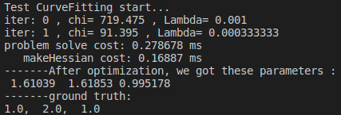
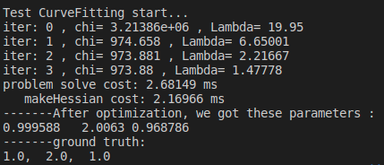

### 1、LM算法估计曲线参数

#### 1.1、绘制阻尼因子变化图像
阻尼因子lambda随迭代次数变化:


#### 1.2 修改曲线方程并完成参数估计
修改残差函数：
```cpp
residual_(0) = abc(0)*x_*x_ + abc(1)*x_ + abc(2) - y_;
```
修改残差对变量的雅可比：
```cpp
jaco_abc << x_ * x_, x_, 1;
```
100次迭代结果：


可见参数陷入局部最优,增加迭代次数至1000:


#### 1.3 其他阻尼因子策略


### 2、公式推导
$$f_{15}= \frac{\partial \alpha_{b_ib_{k+1}}}{\partial \delta b^g_k} =\frac{\partial}{\partial \delta b^g_k} \frac{1}{2}(\frac{1}{2}R_{b_ib_k}\exp \{[(w-\delta b^g_k)\delta t]_{\times}\}(a^{b_{k+1}}-b_k^a))\delta t^2 \\ 
= \frac{1}{4} \delta t^2 \frac{\partial}{\partial \delta b_k^g}R_{b_i b_k}\exp \{ [w\delta t]_{\times}\} \exp \{ [-J_r\delta b_k^g \delta t]_{\times}\}(a^{b_{k+1}}-b^a_k) \\
= -\frac{1}{4}\delta t^2 \frac{\partial}{\partial \delta b^g_k}R_{b_i b_{k+1}}(a^{b_{k+1}}-b^a_k)_{\times}[-J_r \delta b^g_k \delta t]\\
\approx \frac{1}{4} \delta t^2 R_{b_i b_{k+1}}(a^{b_{k+1}}-b^a_k)_{\times}\delta t$$

$$g_{12} = \frac{\partial\alpha_{b_i b_{k+1}}}{\partial \delta n^g_k}=\frac{\partial}{\partial \delta b^g_k}\frac{1}{2}(\frac{1}{2}R_{b_i b_k}\exp \{ [(w+\frac{1}{2}\delta n^g_k)\delta t]_{\times}\}(a^{b_{k+1}}-b_k^a))\delta t^2 \\
= \frac{1}{4} \delta t^2 \frac{\partial}{\partial \delta n_k^g}R_{b_i b_k}\exp \{ [w\delta t]_{\times}\} \exp \{ [\frac{1}{2}J_r\delta n_k^g \delta t]_{\times}\}(a^{b_{k+1}}-b^a_k) \\
= -\frac{1}{4}\delta t^2 \frac{\partial}{\partial \delta n^g_k}R_{b_i b_{k+1}}(a^{b_{k+1}}-b^a_k)_{\times}[\frac{1}{2}J_r \delta n^g_k \delta t] \\
\approx -\frac{1}{8} \delta t^2 R_{b_i b_{k+1}}(a^{b_{k+1}}-b^a_k)_{\times}\delta t $$

### 3、公式证明
由
$$(J^TJ+\mu I)\Delta x_{lm}=-J^Tf \ (V\land V^T+\mu I)\Delta x_{lm}=-J^Tf \\
(V(\land +\mu I)V^T)\Delta x_{lm} =-J^T f $$
$$ F'=(J^Tf)^T$$
$$V^T\Delta x_{lm}=-(\land +\mu I)^{-1}V^TF'^T $$
$$\Delta x_{lm}=- V(\land +\mu I)^{-1}V^TF'^T $$

由于$\land +\mu I$为对角阵，
$$\land (\mu + \mu I)^{-1}V^T= \begin{bmatrix}
    v_1&v_2& \cdots
\end{bmatrix} \begin{bmatrix}
    \frac{1}{\lambda_1 + \mu} & & \\
     & \frac{1}{\lambda_2+\mu} & \\
     & & \ddots
\end{bmatrix} \begin{bmatrix}
    v_1\\v_2\\ \vdots
\end{bmatrix}$$
$$ = \begin{bmatrix}
    v_1\\v_2\\ \vdots
\end{bmatrix} \begin{bmatrix}
    \frac{1}{\lambda_1 + \mu} v_1^T\\\frac{1}{\lambda_2 + \mu} v_2^T\\ \vdots
\end{bmatrix} 
= \sum _{i=1}^n \frac{1}{\lambda_i +\mu}v_iv_i^T $$

所以：
$$\Delta_{lm}= \sum_{i=1}^n \frac{v_i^TF'^T}{\lambda_i+\mu}v_i$$