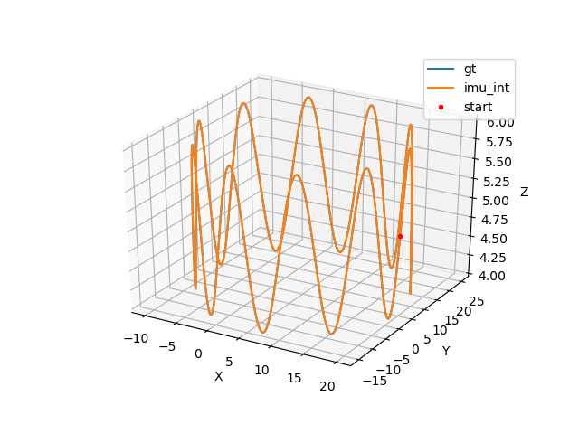

### 基础作业

#### 1、设置IMU仿真代码中的不同参数， 生成Allen方差标定曲线
这里设置了三组实验参数，分别对应高精度、中精度、低精度的IMU。
||IMU0|IMU1|IMU2|
|-|-|-|-|
|陀螺仪高斯白噪声($m/s^2\sqrt{Hz}$)|1.5e-3|1.5e-2|1.5e-1|
|陀螺仪随机游走噪声($m/s^3\sqrt{Hz}$)|5e-6|5e-5|5e-4|
|加速度计高斯白噪声($rad/s\sqrt{Hz}$)|1.9e-3|1.9e-2|1.9e-1|
|加速度计随机游走噪声($rad/s^2\sqrt{Hz}$)|5e-5|5e-4|5e-3|


##### 实验结果
**IMU0**
仿真数据：

标定结果：

Allen曲线：

**IMU1**
仿真数据：

标定结果：

Allen曲线：

**IMU2**
仿真数据：

标定结果：

Allen曲线：


#### 2、使用中值积分替换欧拉积分
中值积分代码：
```cpp
// 中值积分
MotionData last_imupose = imudata[i-1];
MotionData imupose = imudata[i];
Eigen::Quaterniond dq;
Eigen::Vector3d dtheta_half = (last_imupose.imu_gyro+ imupose.imu_gyro)* dt / 4.0;
dq.w() = 1;
dq.x() = dtheta_half.x();
dq.y() = dtheta_half.y();
dq.z() = dtheta_half.z();
dq.normalize();
Eigen::Vector3d acc_w = (Qwb * dq * (imupose.imu_acc) + gw + Qwb * (last_imupose.imu_acc) + gw)/2;
Qwb = Qwb * dq;
Pwb = Pwb + Vw * dt + 0.5 * dt * dt * acc_w;
Vw = Vw + acc_w * dt;
```
欧拉积分与中值积分的结果比较：


中值积分的结果几乎与Groundtruth重合， 所以中值积分的逼近效果更好。
### 提升作业
#### 论文公式推导

k-1次B样条曲线的标准基函数表示为：
$$p(t)= \sum_{i=0}^n p_iB_{i,k}(t)$$
其中，$p_i\in \mathbb{R}^{N}$是$t_i$时刻的控制点，$B_{i,k}(t)$是基函数
$$B_{i,0}(x):=\begin{cases}
1& if \quad t_i \leq x < t_{i+1} \\
0& otherwise
\end{cases}$$
$$
B_{i,p}(x):=\frac{x-t_i}{t_{i+p}-t_i}B_{i,p-1}(x)+\frac{t_{i+p+1}-x}{t_{i+p+1}-t_{i+1}}B_{i+1,p-1}(x)
$$

这里使用的是三次B样条，给定$s_i \leq s(t) < s_{i+1}$, 定义$u(t)=s(t)-s$,得到：
$$\tilde{B}(u)=C\begin{bmatrix}1\\u\\u^2\\u^3
\end{bmatrix}, \dot{B}(u)=\frac{1}{\Delta t}C\begin{bmatrix}0\\1\\2u\\3u^2
\end{bmatrix} ,\ddot{B}(u)=\frac{1}{\Delta t^2}C\begin{bmatrix}0\\0\\2\\6u
\end{bmatrix}$$
$$C=\frac{1}{6}\begin{bmatrix}
6&0&0&0\\5&3&-3&1\\1&3&3&-2\\0&0&0&1
\end{bmatrix}$$
则样条轨迹位姿可以表示为：
$$T_{w,s}(u)=T_{w,i-1}\prod_{j=1}^3 \exp(\tilde{B}(u)_j\Omega_{i+j})$$