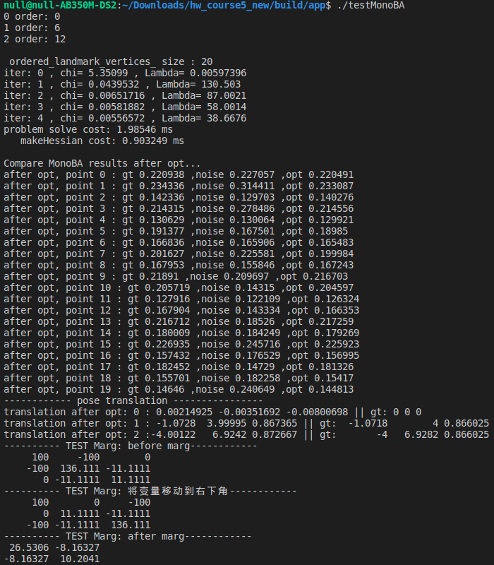
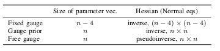
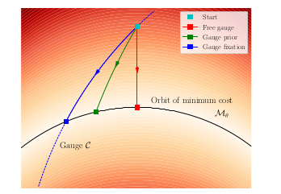
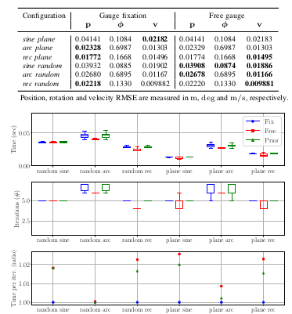

### 题目1 
#### 1.1、完成Problem::MakeHessian()中信息矩阵H的计算

```cpp
// 所有的信息矩阵叠加起来
H.block(index_i, index_j, dim_i, dim_j).noalias() += hessian;
if (j != i) {
    // 对称的下三角
    H.block(index_i, index_j, dim_j, dim_i).noalias()+=hessian.transpose();
}
```

#### 1.2、完成Problem::SolveLinearSystem()中SLAM问题的求解
```cpp
// TODO:: home work. 完成矩阵块取值，Hmm，Hpm，Hmp，bpp，bmm
MatXX Hmm = Hessian_.block(reserve_size,reserve_size, marg_size, marg_size);
MatXX Hpm = Hessian_.block(reserve_size,0, marg_size, reserve_size);
MatXX Hmp = Hessian_.block(0,reserve_size, reserve_size, marg_size);
VecX bpp = b_.segment(0,reserve_size);
VecX bmm = b_.segment(reserve_size,marg_size);
```

```cpp
// TODO:: home work. 完成舒尔补 Hpp, bpp 代码
MatXX tempH = Hpm * Hmm_inv;
H_pp_schur_ = Hessian_.block(0,0,reserve_size,reserve_size) - tempH * Hmp;
b_pp_schur_ = bpp - tempH* Hmp;
```

```cpp
// TODO:: home work. step3: solve landmark
VecX delta_x_ll(marg_size);
delta_x_ll = Hmm_inv*(bmm-Hmp*delta_x_pp);
delta_x_.tail(marg_size) = delta_x_ll;

```

### 题目2
#### 完成Problem::TestMarginalize()中的代码，并通过测试
```cpp
// TODO:: home work. 将变量移动到右下角
/// 准备工作： move the marg pose to the Hmm bottown right
// 将 row i 移动矩阵最下面
Eigen::MatrixXd temp_rows = H_marg.block(idx, 0, dim, reserve_size);
Eigen::MatrixXd temp_botRows = H_marg.block(idx + dim, 0, reserve_size - 
                                                idx - dim, reserve_size);
H_marg.block(idx, 0, dim, reserve_size) = temp_botRows;
H_marg.block(idx+dim, 0, reserve_size-idx-dim, reserve_size) = temp_rows;
```

```cpp
// TODO:: home work. 完成舒尔补操作
Eigen::MatrixXd Arm = H_marg.block(0,n2,n2,m2);
Eigen::MatrixXd Amr = H_marg.block(n2,0,m2,n2);
Eigen::MatrixXd Arr = H_marg.block(0,0,n2,n2);
```

测试结果：


### 题目3

#### 3.1、总结论文中处理H自由度的不同方式，内容包括方式、效果、结论

- Fixed gauge: 强制固定部分状态， 如一个相机的位置和偏移角
- Gauge prior: 为不可观状态添加惩罚项，使H矩阵可逆
- Free gauge: 通过H矩阵的伪逆来提供额外约束

前两种方式需要获取H矩阵需要限制的变量，而第三种方式是普适的。
三种方法对应的H矩阵维度：

三种方法对应的优化路径：

对比实验结果：


结论：
- Free gauge与Fixed gauge 的精度非常接近
- Fixed gauge由于状态较少，每次迭代的速度比其他两种方式快
- 三种方式的最终耗时比较接近
  
### 题目4
#### 在第1、2帧之间添加prior约束，比较BA求解的精度和速度

```cpp
    // 在前两项之间添加prior约束
    double weight = 1e0;
    for(size_t k=0;k<2;k++){
        shared_ptr<EdgeSE3Prior> edge_prior(new EdgeSE3Prior(cameras[k].twc, cameras[k].qwc));
        std::vector<std::shared_ptr<Vertex>> edge_prior_vertex;
        edge_prior_vertex.push_back(vertexCams_vec[k]);
        edge_prior->SetVertex(edge_prior_vertex);
        edge_prior->SetInformation(edge_prior->Information()*weight);
        problem.AddEdge(edge_prior);
    }
```
结果：

|prior weight|耗时(ms)|偏移 RMSE(m)|
|-|-|-|
|1e0|2.99317|0.00375109|
|1e1|3.00451|0.00344424|
|1e2|2.13626|0.151787|
|1e3|1.85535|0.0571291|
|1e4|1.64362|0.151141|
|1e5|1.5064|0.0445676|
|1e5|2.21981|0.0265973|
|1e7|2.20192|0.00457238|
|1e8|0.83456|0.000298569|
|1e9|0.841673|5.14708e-06|
