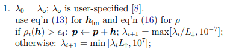
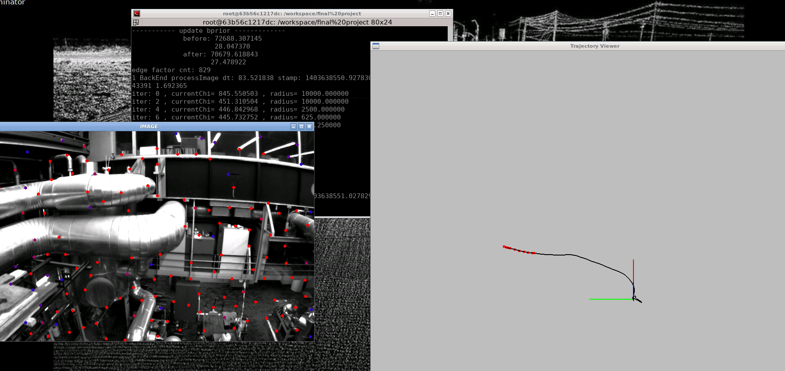
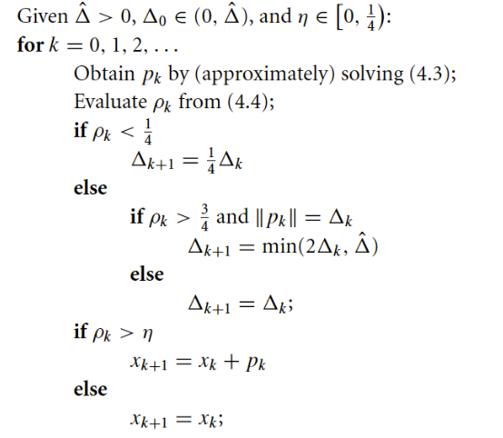

### 题目1 
修改LM更新方式如下:

```cpp
double maxDiagonal = 0;
ulong size = Hessian_.cols();
assert(Hessian_.rows() == Hessian_.cols() && "Hessian is not square");
for (ulong i = 0; i < size; ++i) {
    maxDiagonal = std::max(fabs(Hessian_(i, i)), maxDiagonal);
}
scale = delta_x_.transpose() * (currentLambda_ * maxDiagonal * delta_x_ + b_);
scale += 1e-3;
double rho = (currentChi_ - tempChi) / scale;
if(rho > 0 && isfinite(tempChi))
{
    double scaleFactor = (std::max)(currentLambda_/9, 10e-7);
    currentLambda_ = scaleFactor;
    currentChi_ = tempChi;
    return true;
} else{
    double scaleFactor = (std::min)(currentLambda_/11, 10e+7);
    currentLambda_ = scaleFactor;
    return false;
}
```
运行效果：

evo评价：


### 题目2
实现dog-leg算法

```cpp
// Dogleg 方法=====================================================
// 1、设置参数： 初始值，信赖域上界，信赖域半径，\mu
// 2、寻找最优解：首先确定方向，再确定步长 
bool Problem::SolveDogleg(int iterations) {

    if (edges_.size() == 0 || verticies_.size() == 0) {
        std::cerr << "\nCannot solve problem without edges or verticies" << std::endl;
        return false;
    }

    TicToc t_solve;
    // 统计优化变量的维数，为构建 H 矩阵做准备
    SetOrdering();
    // 遍历edge, 构建 H 矩阵。里面有delta_x_初值
    MakeHessian(); 

    // 使用新的 Chi 和 Lambda 的初始化
    //ComputeLambdaInitLM();
    ComputeChiInitAndLambdaInit();
    
    // 尝试把 r 从1 增大到 1e4 来避免MH-05数据集上漂移的问题
    bool found = false;
    radius_ = 1e4;

    //bool stop = false;
    int iter = 0;
    const int numIterationsMax = 10;
    double last_chi_ = 1e20;

    while ( !found && (iter < numIterationsMax)) {
        std::cout << "iter: " << iter << " , currentChi= " << currentChi_ << " , radius= " << radius_ << std::endl;
        iter++;

        bool oneStepSuccess = false;
        int false_cnt = 0;
        while (!oneStepSuccess && false_cnt < 10)  // 不断尝试 Lambda, 直到成功迭代一步
        {
            // 计算alpha 和 h_gn 
            VecX auxVector1 = Hessian_ * b_;
            double alpha_ = b_.squaredNorm() / auxVector1.dot(b_);
            //alpha_ = b_.squaredNorm() / (b_.transpose()*Hessian_*b_);
            h_sd_ = alpha_ * b_;
            // To Do: 此处Hessian_比较大, 直接求逆很耗时, 可采用 Gauss-Newton法求解
            //h_gn_ = Hessian_.inverse() * b_;
            h_gn_ = Hessian_.ldlt().solve(b_);

            double h_sd_norm = h_sd_.norm();
            double h_gn_norm = h_gn_.norm();

            // 计算h_dl 步长
            if ( h_gn_norm <= radius_){
                h_dl_ = h_gn_;
            // 此处条件判断直接用了 h_sd_norm, 和论文的 alpha_*h_sd_norm不同
            }else if ( h_sd_norm >= radius_ ) { 
                // 此处条件判断 直接用了 h_sd_norm, 和论文的 alpha_*h_sd_norm不同
                h_dl_ = ( radius_ / h_sd_.norm() ) * h_sd_;
            } else {
                // 计算beta用于更新步长(此处a直接等于 h_sd_, 和论文的 alpha_* h_sd_ 有所不同)
                //VecX a = alpha_ * h_sd_;            
                VecX a  = h_sd_;
                VecX b = h_gn_;
                //double c = a.transpose() * (b - a);
                  double c = h_sd_.dot( b - a );
                if (c <= 0){
                    beta_ = ( -c + sqrt(c*c + (b-a).squaredNorm() * (radius_*radius_ - a.squaredNorm())) )
                             / (b - a).squaredNorm();
                }else{ 
                    beta_ = (radius_*radius_ - a.squaredNorm()) / (c + sqrt(c*c + (b-a).squaredNorm() 
                            * (radius_*radius_ - a.squaredNorm())));
                }
                assert(beta_ > 0.0 && beta_ < 1.0 && "Error while computing beta");
                //h_dl_ = alpha_ * h_sd_  + beta_ * (h_gn_ - alpha_ * h_sd_);
                // 此处 a 直接等于 h_sd_, 和论文的有所不同
                h_dl_= a + beta_ * ( b - a );
            } 
            delta_x_ = h_dl_;

            UpdateStates();
            oneStepSuccess = IsGoodStepInDogleg();
            // 后续处理，
            if(oneStepSuccess)
            {
                MakeHessian();
                false_cnt = 0;
            }
            else
            {
                false_cnt++;
                RollbackStates();
            }

        }
        iter++;

        if(last_chi_ - currentChi_ < 1e-5  || b_.norm() < 1e-5 )
        {
            std::cout << "Dogleg: find the right result. " << std::endl;
            found = true;
        }
        last_chi_ = currentChi_;
    }
    std::cout << "problem solve cost: " << t_solve.toc() << " ms" << std::endl;
    std::cout << "   makeHessian cost: " << t_hessian_cost_ << " ms" << std::endl;
    // 记录本次Hessian处理时长
    hessian_time_per_frame = t_hessian_cost_; 
    // 记录本次frame时长(包括hessian时长)
    time_per_frame = t_solve.toc();
    // 记录本frame的求解次数
    solve_count_per_frame = iter;
    
    SaveCostTime("costTime.txt", t_solve.toc(), t_hessian_cost_);
    t_hessian_cost_ = 0.;
    return true;
}

// Dogleg策略因子, 用于判断 Lambda 在上次迭代中是否可以，以及Lambda怎么缩放
bool Problem::IsGoodStepInDogleg(){
    double tempChi = 0.0;
    for (auto edge: edges_) {
        edge.second->ComputeResidual();
        tempChi += edge.second->RobustChi2();
    }
    if (err_prior_.size() > 0)
        tempChi += err_prior_.norm();
    tempChi *= 0.5;          // 1/2 * err^2

    // 计算rho
    double scale=0.0;
    if(h_dl_ == h_gn_){
        scale = currentChi_;
    } else if(h_dl_ == radius_ * b_ / b_.norm()) {
        scale = radius_ * (2 * (alpha_ * b_).norm() - radius_) / (2 * alpha_);
    } else { 
         scale = 0.5 * alpha_ * pow( (1 - beta_), 2) * b_.squaredNorm() 
                    + beta_ * (2 - beta_) * currentChi_;
    }

    double nonLinearGain = currentChi_ - tempChi; 
    double linearGain = - double(delta_x_.transpose() * Hessian_ * delta_x_) + 2 * b_.dot(delta_x_); 
    double rho_ = nonLinearGain / scale;

    if (rho_ > 0.75 && isfinite(tempChi)) {
        radius_ = std::max(radius_, 3 * delta_x_.norm());
    }
    else if (rho_ < 0.25) {
        radius_ = std::max(radius_ / 4, 1e-7);
    } else {
        // do nothing
    }

   if (rho_ > 0 && isfinite(tempChi)) {
        currentChi_ = tempChi;
        return true;
    } else {
        return false;
    }
}
```

evo评价：


### 题目三


---
代码参考：[https://github.com/why-freedom/VIOLearning_Note_Code/tree/master/final%20project](https://github.com/why-freedom/VIOLearning_Note_Code/tree/master/final%20project)