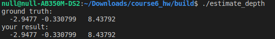
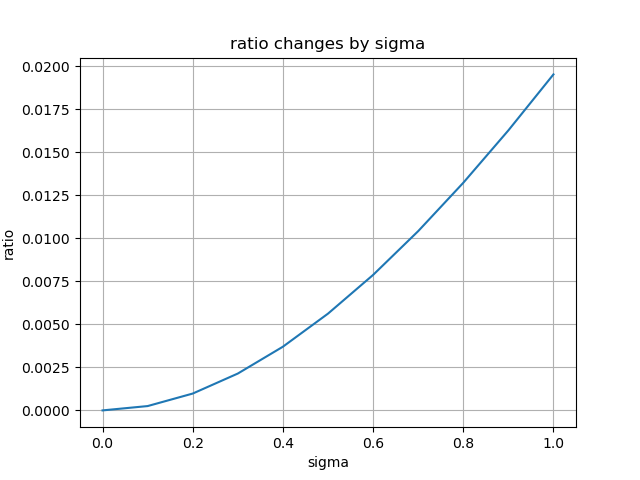
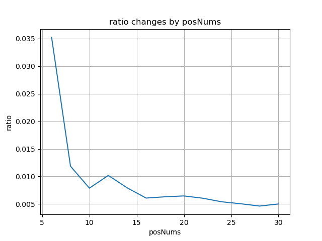

### 题目1 
$$\min_y ||Dy||_2^2,  \qquad s.t.||y||=1$$
证明：
通过拉格朗日乘子法构造目标方程：
$$F(y)=y^TD^TDy-\lambda(y^Ty-1)$$
令$F'(y)=0$,有
$$D^TDy-\lambda y=0$$
将其代入目标方程，有
$$F(y)=\lambda y^Ty-\lambda y^Ty+\lambda = \lambda$$
所以，要使目标方程达到最小值，$\lambda$应最小，其对应的特征向量为$u_4$，即证

### 题目2
#### 特征点三角化
代码：
```cpp
    /* your code begin */
    const auto D_rows = 2*(end_frame_id-start_frame_id);
    Eigen::MatrixXd D(Eigen::MatrixXd::Zero(D_rows, 4));
    for(auto i=start_frame_id;i<end_frame_id;++i)
    {
        Eigen::Matrix3d Rcw = camera_pose[i].Rwc.transpose();
        Eigen::Vector3d tcw = -Rcw *camera_pose[i].twc;
        D.block(2*(i-start_frame_id), 0,1,3).noalias() = camera_pose[i].uv(0)*Rcw.block(2,0,1,3)-Rcw.block(0,0,1,3);
        D.block(2*(i-start_frame_id),3,1,1).noalias() = camera_pose[i].uv(0)*tcw.segment(2,1)-tcw.segment(0,1);
        D.block(2*(i-start_frame_id)+1, 0,1,3).noalias() = camera_pose[i].uv(1)*Rcw.block(2,0,1,3)-Rcw.block(1,0,1,3);
        D.block(2*(i-start_frame_id)+1,3,1,1).noalias() = camera_pose[i].uv(1)*tcw.segment(2,1) - tcw.segment(1,1);
    }
    Eigen::JacobiSVD<Eigen::MatrixXd> svd(D.transpose()*D,Eigen::ComputeThinU| Eigen::ComputeThinV);
    Eigen::Vector4d lambda = svd.singularValues();
    if(lambda(2)/lambda(3)<1e-3) return -1;
    Eigen::Vector4d u4 = svd.matrixU().block(0,3,4,1);
    if(u4(3)!=0 && u4(2)/u4(3)>0){
        P_est(0) = u4(0)/u4(3);
        P_est(1) = u4(1)/u4(3);
        P_est(2) = u4(2)/u4(3);
    }

    /* your code end */
```
结果：


### 题目3

#### 3.1、 不同噪声对后两个特征值比值的影响
噪声方差在0-1之间对应的两个特征值比值：

噪声越大， u4/u3越大，结果越不准确。
#### 3.2、 不同帧数对后两个特征值比值的影响
固定噪声方差为0.6，图像帧数在6-30之间对应的两个特征值比值：

可以看出，图像帧数越多， u4/u3越小， 结果越准确。