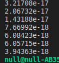

### 题目1 
#### 1.1、绘制信息矩阵$\land$

考虑题目中的观测关系，共有6个顶点，9条边，所以状态量和残差可以表示为：
$$x=\begin{bmatrix}
\xi_1\\\xi_2\\\xi_3\\L_1\\L_2\\L_3
\end{bmatrix},  r=\begin{bmatrix}
    r_{l_1\xi_1}\\r_{l_1\xi_2}\\r_{l_2\xi_1}\\r_{l_2\xi_2}\\r_{l_2\xi_3}\\r_{l_3\xi_2}\\r_{l_3\xi_3}\\r_{\xi_1\xi_2}\\r_{\xi_2\xi_3}
\end{bmatrix}$$

雅可比矩阵可以表示为:$J=\frac{\partial r}{\partial b}$
不考虑各雅可比项之间的差异，9项雅可比可以表示为：
$$\frac{\partial r_{l_1\xi_1}}{\partial x} = \begin{bmatrix}
    1&0&0&1&0&0\\0&0&0&0&0&0\\0&0&0&0&0&0\\1&0&0&1&0&0\\0&0&0&0&0&0\\0&0&0&0&0&0\\
\end{bmatrix}, \frac{\partial r_{l_1\xi_2}}{\partial x} = \begin{bmatrix}
    0&0&0&0&0&0\\0&1&0&1&0&0\\0&0&0&0&0&0\\0&1&0&1&0&0\\0&0&0&0&0&0\\0&0&0&0&0&0\\
\end{bmatrix},\frac{\partial r_{l_2\xi_1}}{\partial x} = \begin{bmatrix}
    1&0&0&0&1&0\\0&0&0&0&0&0\\0&0&0&0&0&0\\0&0&0&0&0&0\\1&0&0&0&1&0\\0&0&0&0&0&0\\
\end{bmatrix}$$
$$\frac{\partial r_{l_2\xi_2}}{\partial x} = \begin{bmatrix}
    0&0&0&0&0&0\\0&1&0&0&1&0\\0&0&0&0&0&0\\0&0&0&0&0&0\\0&1&0&0&1&0\\0&0&0&0&0&0\\
\end{bmatrix}, \frac{\partial r_{l_2\xi_3}}{\partial x} = \begin{bmatrix}
    0&0&0&0&0&0\\0&0&0&0&0&0\\0&0&1&0&1&0\\0&0&0&0&0&0\\0&0&1&0&1&0\\0&0&0&0&0&0\\
\end{bmatrix},\frac{\partial r_{l_3\xi_2}}{\partial x} = \begin{bmatrix}
    0&0&0&0&0&0\\0&1&0&0&0&1\\0&0&0&0&0&0\\0&0&0&0&0&0\\0&0&0&0&0&0\\0&1&0&0&0&1\\
\end{bmatrix}$$
$$\frac{\partial r_{l_3\xi_3}}{\partial x} = \begin{bmatrix}
    0&0&0&0&0&0\\0&0&0&0&0&0\\0&0&1&0&0&1\\0&0&0&0&0&0\\0&0&0&0&0&0\\0&0&1&0&0&1\\
\end{bmatrix}, \frac{\partial r_{\xi_1\xi_2}}{\partial x} = \begin{bmatrix}
    1&1&0&0&0&0\\1&1&0&0&0&0\\0&0&0&0&0&0\\0&0&0&0&0&0\\0&0&0&0&0&0\\0&0&0&0&0&0\\
\end{bmatrix},\frac{\partial r_{\xi_2\xi_3}}{\partial x} = \begin{bmatrix}
    0&0&0&0&0&0\\0&1&1&0&0&0\\0&1&1&0&0&0\\0&0&0&0&0&0\\0&0&0&0&0&0\\0&0&0&0&0&0\\
\end{bmatrix}$$
所以:
$$\frac{\partial r}{\partial x} = \begin{bmatrix}
    3&1&0&1&1&0\\1&5&1&1&1&1\\0&1&3&0&1&1\\1&1&0&2&0&0\\1&1&1&0&3&0\\0&1&1&0&0&2\\
\end{bmatrix}$$

#### 1.2、绘制相机$\xi_1$被marg后的$\land'$
令$\beta=\xi_1,\alpha=\begin{bmatrix}\xi_2&\xi_3&L_1&L_2&L_3\end{bmatrix}$  
由边缘化公式：
$$\land'=\land_{\alpha\alpha}-\land_{\alpha\beta}\land_{\beta\beta}^{-1}\land_{\beta\alpha}$$
$$ = \begin{bmatrix}
    5&1&1&1&1\\1&3&0&1&1\\1&0&2&0&0\\1&1&0&3&0\\1&1&0&0&2 
\end{bmatrix}- \begin{bmatrix}
    1\\0\\1\\1\\0
\end{bmatrix}\times \begin{bmatrix}
    3
\end{bmatrix}^{-1}\begin{bmatrix}
    1&0&1&1&0
\end{bmatrix}\\=\begin{bmatrix}
\frac{14}{3}&1&\frac{2}{3}&\frac{2}{3}&1\\1&3&0&1&1\\\frac{2}{3}&0&\frac{5}{3}&-\frac{1}{3}&0\\\frac{2}{3}&1&-\frac{1}{3}&\frac{8}{3}&0\\1&1&0&0&2 
\end{bmatrix}$$
可以看出，$L_1,L_2$之间增加了约束。

### 题二 
#### 证明信息矩阵与协方差的逆之间的关系
假设高斯随机向量$\theta$,均值为$\hat{\theta}$,协方差矩阵为$\Sigma$,则其联合概率密度为：
$$p(\theta)=(2\pi)^{-N/2}\|\Sigma\|^{-\frac{1}{2}}\exp[\frac{1}{2}(\theta-\hat{\theta})^T\Sigma^{-1}(\theta-\hat{\theta})]$$
目标函数可以定义为概率密度函数的副对数：
$$J(\theta)=-\ln p(\theta)= \frac{N}{2}\ln \pi+\frac{1}{2}\ln\|\Sigma\|+\frac{1}{2}(\theta-\hat{\theta})^T\Sigma^{-1}(\theta-\hat{\theta})$$
对$\theta_i,\theta_j$求导有：
$$H_{\theta_i \theta_j}=\frac{\partial^2 J(\theta)}{\partial \theta_i \partial \theta_j}|\theta=\hat{\theta}=\Sigma_{i,j}^{-1}$$
所以信息矩阵等价于协方差的逆

### 题三
#### 补全Hessian矩阵的计算

残差对路标点的雅可比为：
$$J_P=\begin{bmatrix}
    \frac{f_x}{z} &0&-\frac{xf_x}{z^2}\\0&\frac{f_y}{z}&-\frac{yf_x}{z^2}
\end{bmatrix}R_{cw}$$
对相机位姿的雅可比：
$$J_T=\begin{bmatrix}
    -\frac{xyf_x}{z^2}&(1+\frac{x^2}{z^2})f_x&-\frac{yf_x}{z}&\frac{f_x}{z}&0&-\frac{xf_x}{zZ^2}\\-(1+\frac{y^2}{z^2})f_y& -\frac{xyf_y}{z^2}&\frac{xf_y}{z}&0&\frac{f_y}{z}&-\frac{yf_y}{z^2}
\end{bmatrix}R_{cw}$$
则$H$矩阵为：
$$H=\begin{bmatrix}
    J_T^TJ_T&J^T_TJ_P\\J^T_PJ_T&J^T_PJ_P
\end{bmatrix}$$


代码：
```cpp
H.block(i*6,i*6,6,6) += jacobian_Ti.transpose() * jacobian_Ti;
H.block(j*3+6*poseNums,j*3+6*poseNums,3,3)+= jacobian_Pj.transpose()*jacobian_Pj;
H.block(i*6,j*3+6*poseNums,6,3) += jacobian_Ti.transpose()*jacobian_Pj;
H.block(j*3+6*poseNums,i*6,3,6) += jacobian_Pj.transpose()*jacobian_Ti;
```
结果：
